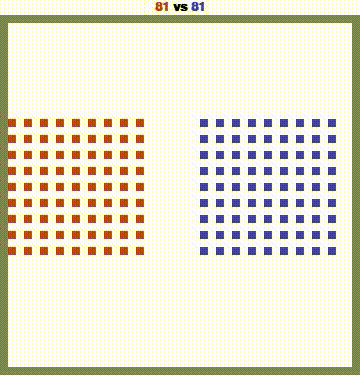

# Multi-Agent Battle Tactics
## Overview  
This project involved training an RL agent in the MAgent2 `battle` environment and evaluating it against three opponents: random agents, a pretrained agent, and a final stronger agent. Performance was measured by reward and win rate while controlling *blue* agents.  

1. Random Agents: Agents that take random actions in the environment.
2. A Pretrained Agent: A pretrained agent provided in the repository.
3. A Final Agent: A stronger pretrained agent, which will be released in the final week of the course before the deadline.

Agent's performance should be evaluated based on reward and win rate against each of these models. You should control *blue* agents when evaluating.

## Results  
My agent (blue) achieved a dominant performance, securing a 100% win rate against all three types of opponents.  
<p align="center">
  <figure>
    
    <figcaption>Random Agent Vs Random Agent</figcaption>
  </figure>
  <figure>
    
    <figcaption>Pretrained Agent Vs My Agent</figcaption>
  </figure>
  <figure>
    
    <figcaption>Final Agent Vs My Agent</figcaption>
  </figure>
</p>


### Report
View my report here: [Reinforcement Learning Project Documentation](Reinforcement_Learning_Project.pdf)

## Installation
clone this repo and install with
```
pip install -r requirements.txt
```

## References

1. [MAgent2 GitHub Repository](https://github.com/Farama-Foundation/MAgent2)
2. [MAgent2 API Documentation](https://magent2.farama.org/introduction/basic_usage/)

For further details on environment setup and agent interactions, please refer to the MAgent2 documentation.
